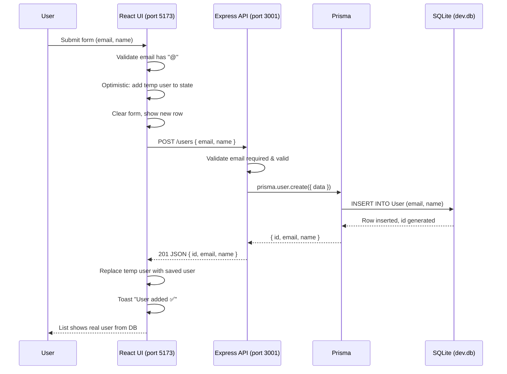

# Add User Flow: UI → API → DB → UI

Visual breakdown of what happens when you create a user in the app.

---

## Sequence Diagram (Mermaid)



---

## Step-by-Step Breakdown

| Step | Where | What happens |
|------|--------|----------------|
| **1** | **Browser (UI)** | User fills email + optional name and clicks "Add". |
| **2** | **App.jsx** | `addUser(e)` runs: `e.preventDefault()`, trims email/name. |
| **3** | **App.jsx** | Client-side check: if email has no `@`, show toast and stop. |
| **4** | **App.jsx** | **Optimistic update**: Create `{ id: "temp-...", email, name }`, call `setUsers([optimistic, ...prev])`, clear form. User sees the new row immediately. |
| **5** | **App.jsx** | `fetch("http://localhost:3001/users", { method: "POST", body: JSON.stringify({ email, name }) })` — request leaves the UI. |
| **6** | **Network** | HTTP POST goes from browser (5173) to API (3001). CORS allows it because origin `http://localhost:5173` is in the server’s CORS config. |
| **7** | **server/index.js** | Express `POST /users` handler runs. Reads `req.body` (email, name). |
| **8** | **server/index.js** | Server validates: email required, must contain `@`. Returns 400 if invalid. |
| **9** | **server/index.js** | `prisma.user.create({ data: { email, name } })` — Prisma is called. |
| **10** | **Prisma → SQLite** | Prisma turns that into `INSERT INTO User (email, name)` and talks to `dev.db`. SQLite generates `id` (autoincrement) and writes the row. |
| **11** | **server/index.js** | Prisma returns `{ id, email, name }`. Server sends `res.status(201).json(user)`. |
| **12** | **App.jsx** | `await res.json()` gives the saved user. `setUsers(prev => prev.map(u => u.id === tempId ? saved : u))` — temp row is replaced by the real user (with real `id`). |
| **13** | **App.jsx** | `setToast("User added ✅")`. Toast clears after a short delay. |
| **14** | **Browser (UI)** | List re-renders with the saved user from the DB; data is now persisted in SQLite. |

---

## Component / File Map

```
┌─────────────────────────────────────────────────────────────────┐
│  BROWSER (localhost:5173)                                       │
│  ┌───────────────────────────────────────────────────────────┐  │
│  │  client/src/App.jsx                                       │  │
│  │  • Form: email, name → addUser()                           │  │
│  │  • Optimistic: setUsers([temp, ...prev])                  │  │
│  │  • fetch("http://localhost:3001/users", POST)             │  │
│  │  • On success: replace temp with saved, toast             │  │
│  └───────────────────────────────────────────────────────────┘  │
└─────────────────────────────────────────────────────────────────┘
                              │
                              │  HTTP POST /users
                              │  Body: { email, name }
                              ▼
┌─────────────────────────────────────────────────────────────────┐
│  API SERVER (localhost:3001)                                     │
│  ┌───────────────────────────────────────────────────────────┐  │
│  │  server/index.js                                           │  │
│  │  • app.post("/users") → validate → prisma.user.create()    │  │
│  │  • res.status(201).json(user)                              │  │
│  └───────────────────────────────────────────────────────────┘  │
│                              │                                   │
│                              │  prisma.user.create({ data })      │
│                              ▼                                   │
│  ┌───────────────────────────────────────────────────────────┐  │
│  │  Prisma Client                                             │  │
│  │  • Translates to SQL, manages connection                   │  │
│  └───────────────────────────────────────────────────────────┘  │
└─────────────────────────────────────────────────────────────────┘
                              │
                              │  SQL INSERT
                              ▼
┌─────────────────────────────────────────────────────────────────┐
│  DATABASE                                                        │
│  ┌───────────────────────────────────────────────────────────┐  │
│  │  server/prisma/dev.db (SQLite)                            │  │
│  │  • User table: id (PK), email (unique), name              │  │
│  │  • Row persisted on disk                                  │  │
│  └───────────────────────────────────────────────────────────┘  │
└─────────────────────────────────────────────────────────────────┘
```

---

## Data Shape Along the Way

| Stage | Data |
|--------|------|
| Form input | `email: "alice@example.com"`, `name: "Alice"` |
| Optimistic (UI) | `{ id: "temp-1738...", email, name, createdAt: "..." }` |
| Request body | `{ email: "alice@example.com", name: "Alice" }` |
| After DB insert | `{ id: 1, email: "alice@example.com", name: "Alice" }` (from Prisma `select`) |
| Response to UI | Same object; UI replaces temp row with this. |

---

## Error Paths

- **Client**: No `@` in email → toast, no request.
- **API**: Missing/invalid email → `400`, UI keeps optimistic row then removes it in `catch` and shows error toast.
- **API**: Duplicate email (P2002) → `409`, same rollback + toast.
- **API**: Other error → `500`, same rollback + toast.
- **Network failure**: `fetch` throws → catch runs, optimistic row removed, toast shows error.

This is the full path from clicking "Add" to the user being stored in the DB and reflected back in the UI.
